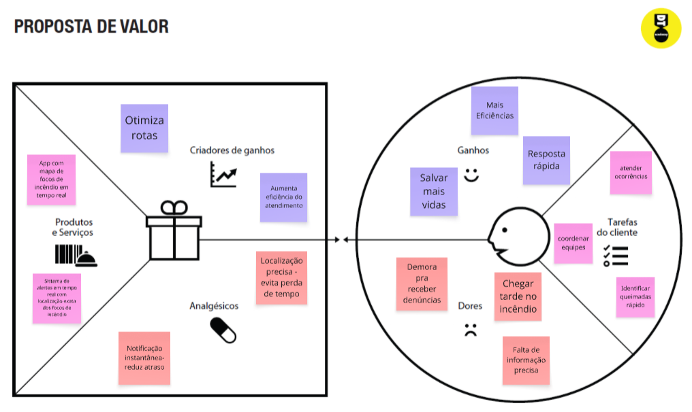
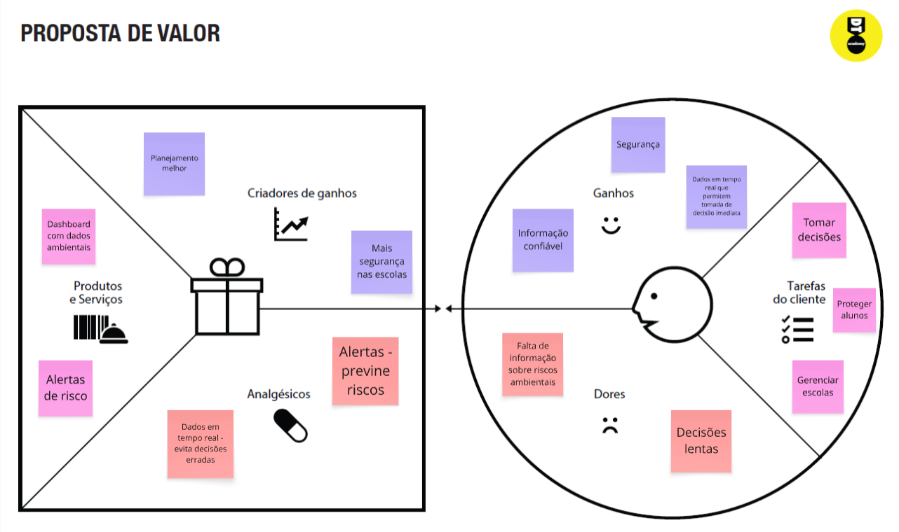
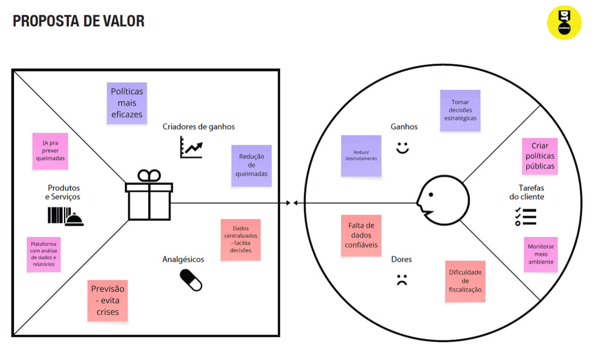
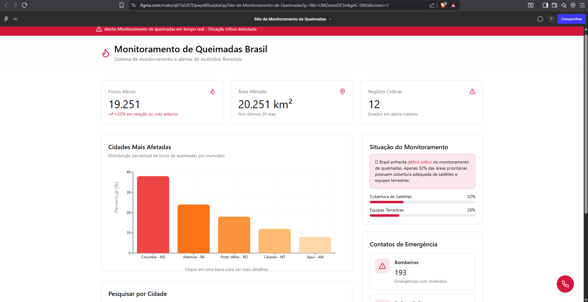
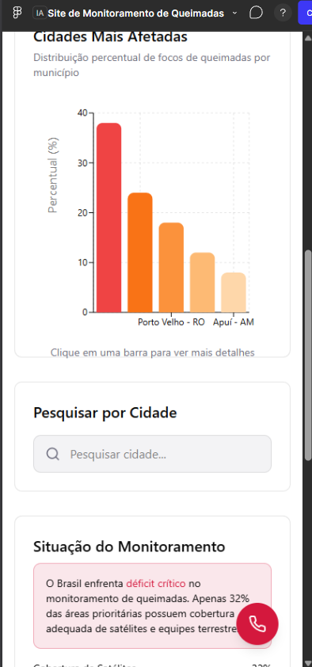
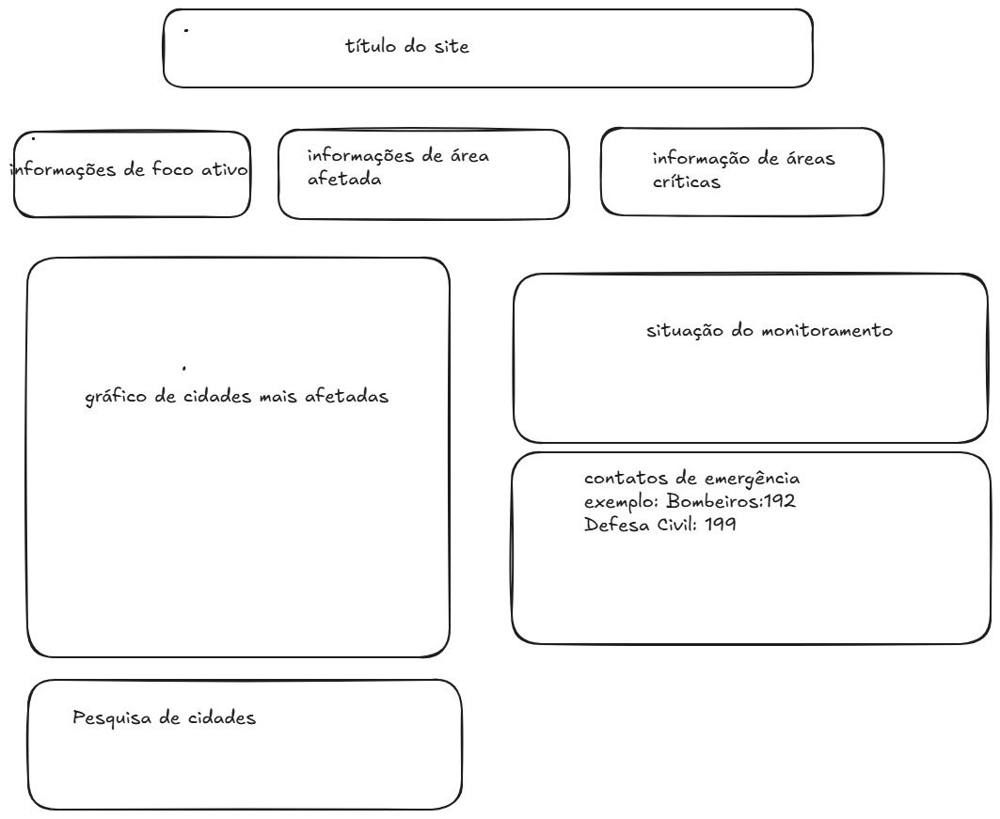

# TI-monitoramento-de-queimadas

1. Introdução

* Projeto: A falta de monitoramento das queimadas

* Repositório GitHub: [REPOSITÓRIO](https://github.com/LuizFelipeChpp/TI-monitoramento-de-queimadas.git)

* Membros da equipe:

  ○ Diego Ribeiro

  ○ Matheus Oliveira Costa Torres 

  ○ Luiz Felipe Pereira Guimarães  

  ○ Thales Caires Ferraz

  ○ Ygor Magalhães

  ○ Luiz Augusto Cipriani

  ○ Allan Cristian Rodrigues

A documentação do projeto é estruturada da seguinte forma:

2. Contexto: 

O aumento das queimadas no Brasil tem se tornado um problema recorrente, causando impactos ambientais, sociais e econômicos. A falta de monitoramento eficiente dificulta a identificação rápida de focos de incêndio, atrasando ações de combate e prevenção.
Atualmente, o acompanhamento dessas ocorrências depende de sistemas descentralizados e denúncias da população, o que torna o processo lento e pouco eficiente

○ Problema: 
A principal dificuldade é a falta de um sistema centralizado e acessível para monitoramento de queimadas. Isso acaba gerando a demora de identificação dos focos de incêncio, falta de acesso rápido a informação, consequentemente causando dificuldades nas tomadas de decisão.

○ Objetivo do projeto: 
Desenvolver um software para auxiliar no monitoramento de queimadas. Com propostas para centralizar   dados em uma unica plataforma, facilitar o acesso à informação e melhorar a visualização dos dados.

○ Justificativa:
As queimadas impactam diretamente o meio ambiente, a sociedade e a economia. A dificuldade em monitorar e agir rapidamente agrava cada vez mais a situação.
O projeto busca utilizar a tecnologia para melhorar o acesso à informação e apoiar decisões mais rápidas e eficientes, contribuindo para minimizar os impactos causados pelas queimadas.

○ Público alvo:
O sistema é voltado principalmente para pessoas como Bombeiros, Gestores Público para tomarem a melhor decisão sobre a situação e a população local afetada pelos incendios

3. Product Discovery

Matriz CSD:

Certezas: 
•As queimadas acontecem com frequencia nas areas periurbanas
•A fumaça e o fogo geram riscos ambientais se à saúde da população
•Muitas ocorrências são indentificadas tarde ou apenas após denúncias da população
•A defesa civil e o corpo de bombeiros são responsáveis por atender essas ocorrências

Suposições:
•Parte das queimadas pode ser causada por queima de lixo, limpeza de terrenos ou ação humana
•A população pode não saber como ou onde denunciar rapidamente um foco de incêndio
•Condições climáticas como tempo seco e altas temperaturas aumentam a probabilidade de queimadas
•Campanhas de conscientização poderiam diminuir queimadas causadas por ação humana

Duvidas:
•Qual é o tempo médio de resposta da Defesa Civil ou dos Bombeiros para essas ocorrências?
•Existe alguma tecnologia ou sistema de monitoramento já utilizado atualmente?
•Como a população poderia participar do monitoramento ou denúncia?

○ Mapa Stakeholders:

Corpo de Bombeiros: responsáveis pelo combate direto às queimadas, necessitam de informações rápidas e precisas para agirem coeficiencia
   
Moradores das regiões afetadas : pode ser afetada pelas queimadas e podem também contribuir com denúncias e informações

Defesa civil: atuação em situações de emergência

Ministerio do meio ambiente: responsável por melhorias nas políticas ambientais

○ Pesquisa e entendimento do problema: 
A análise do problema mostra que a falta de centralização das informações dificulta ações rápidas de profissionais no combataqueimadas. Além disso, diferentes usuários possuem necessidades específicas que não são atendidas pelos sistemas atuais, como poexemplo as pessoas que moram perto de regiões de queimadas, onde muitas vezes tem que sair do lugar que moram para não correrem riscomaiores

○ Personas:

•Persona 1:  
Nome: Rafael Silva.
Idade:37 anos
Hobby: Ler livros
Trabalho: Bombeiro
Personalidade: Centrado; Metódico; Altruísta
Sonho: Ajudar o maximo de pessoas possíveis

•Persona 2: 
Nome: Renata Soares.
Idade: 31
Hobby: Cuidar das plantas; Cozinhar
Trabalho: Secretária Municipal da educação
Personalidade: Extrovertida; sociável; paciente.
Sonhos: Ter uma família e ser bem-sucedida

•Persona 3:
Nome: Cléber Ramos 
Idade: 44
Hobby: Passar tempo com a família
Trabalho: Ministro do Meio Ambiente
Personalidade: Sociável; pragmático; entusiasmada
Sonhos: Reduzir drasticamente o desmatamento e a degradação ambiental.

4. Product Design

○ História de usuários:
    
Rafael Silva: Como bombeiro quero que as denúncias de queimadas sejam mais otimizadas porque eu quero ajudar as pessoas mais rápidde uma forma mais eficiente.

Renata Soares: Como vítima da área afeteda pelas queimadas, quero que o serviço ajude a resolver o problema mais rápido para que apessoas, animais, flora sofram o mínimo possível.

Cléber Ramos: Quero que o serviço de combate às queimadas seja mais ágil e eficiente, para que pessoas, animais e a flora sofram mínimo possível.

○ Proposta de Valor:

Proposta de valor Rafael Silva:

Proposta de valor Renata Soares:

Proposta de valor Cléber Ramos:

○ Projeto De Interface: 

Fluxo de usuário:

Imagem do site no PC:

imagem do site no MOBILE:

wireframe:

Wireframe do prototipo:

prototipo interativo: 
[PROTÓTIPO INTERATIVO](https://www.figma.com/make/q87isGR7Dpwp405urpkaGp/Site-de-Monitoramento-de-Queimadas?p=f&t=UMZeeoxDF3inkgAC-0&fullscreen=1)

5. Metodologia○ Ferramentas:

Editor de código: Visual Studio Code

ferramentas de comunicação: Usamos o WhatsApp para comunicação rápida entre os membros da equipe e o Discord utilizado para reuniõee discussões mais detalhadas, permitindo chamadas de voz e compartilhamento de tela.

ferramentas de diagramação: Usamos o Canva para a criação dos slides e apresentação do projeto, permitindo um design visuaorganizado e atrativo. Também usamos o miro para a elaboração de diagramas e organização das ideias do sistema, como a definição dobjetivo do grupo, matriz CSD, personas, mapa de valor, entre outros.

  
○ Organização da equipe e divisão de papeis:

A equipe se organizou de forma colaborativa, dividindo as tarefas de acordo com as habilidades de cada integrante.
Cada membro ficou responsável por uma parte do projeto, como:
Pesquisa sobre queimadas e levantamento de informações;
Desenvolvimento da ideia da solução;
Criação dos slides e apresentaçãoOrganização do conteúdo escrito;
A comunicação foi feita principalmente por meio do WhatsApp, permitindo alinhamento rápido entre os integrantes.
As decisões foram tomadas em conjunto, garantindo que todos participassem do desenvolvimento do trabalho.

○ Quadro de controle de tarefas: 

Para o acompanhamento das atividades, o grupo utilizou uma organização simples das tarefas:
 A fazer: tarefas ainda não iniciadas;
Em andamento: tarefas sendo realizadas;
Concluído: tarefas já finalizadas;
Essaivisão ajudou a equipe a manter o controle do progresso e cumprir os prazos estabelecidos.

6. Solução

Proposta de solução:

A proposta de solução consiste em um ecossistema de monitoramento em tempo real, desenvolvido para atacar diretamente o déficit d70% de cobertura que o Brasil enfrenta hoje no setor. O objetivo central é converter dados complexos em inteligência acionável tantpara a população quanto para as autoridades locais. Ao observarmos o dashboard, notamos que o sistema centraliza o controle de focoativos e o mapeamento de áreas afetadas em quilômetros quadrados, permitindo uma análise geoespacial precisa. 

7. Referências Bibliográficas: 
[Referência 1](https://www.camara.leg.br/noticias/701725-ministerio-publico-aponta-falta-de-acao-do-governo-federal-em-relacao-a-queimadas/) [Referência 2](https://terrabrasilis.dpi.inpe.br/queimadas/situacao-atual/situacao_atual/)